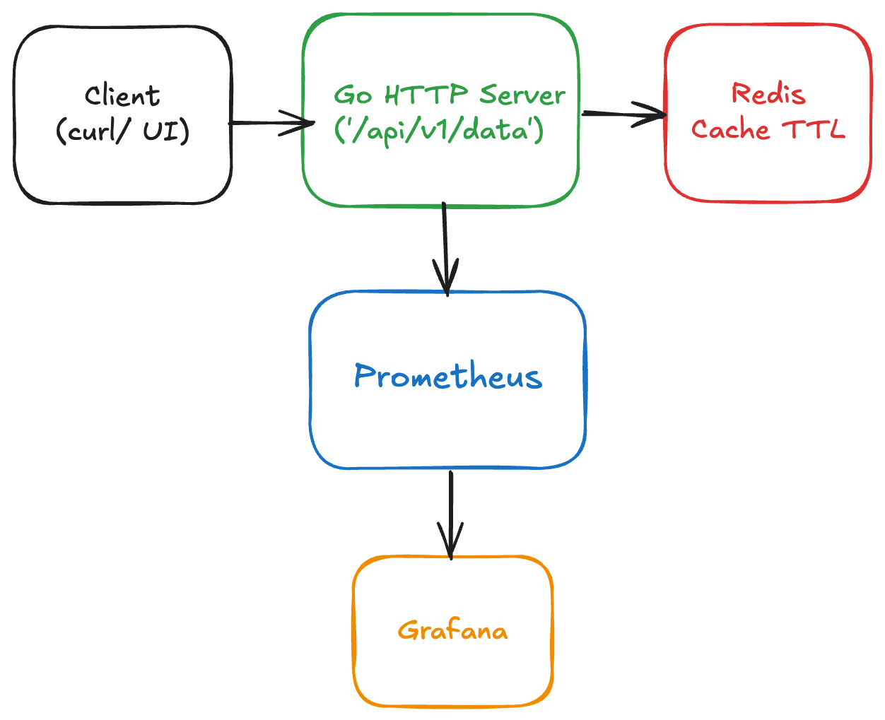

# platform-service

[](https://golang.org)

A production-grade Go microservice with Redis caching, Prometheus metrics, and automated CI/CD.

---

## Architecture

**Stack:**

- **Go HTTP server** : `/api/v1/data`, `/healthz`, `/readyz`, `/metrics`
- **Redis** : cache-aside pattern with configurable TTL
- **Prometheus + Grafana** : metrics and visualization
- **Python tests** : integration and load testing (pytest + locust)
- **GitHub Actions** : automated build, test, and deploy

**Architecture Diagram:**



## Quick Start

```bash
# Clone and start
git clone https://github.com/shivaacodes/platform-service.git
cd platform-service
docker compose up --build
```

**Endpoints:**

- <http://localhost:8080/api/v1/data> : cached data
- <http://localhost:8080/readyz> : health check (validates Redis)
- <http://localhost:8080/metrics> : Prometheus metrics
- <http://localhost:3000> : Grafana dashboard

**Stop:**

```bash

docker compose down
```

---

## Configuration

Set via environment variables or `.env` file:

```env
PORT=8080
REDIS_ADDR=redis:6379
CACHE_TTL=300
LOG_LEVEL=info
```

---

## CI/CD Pipeline

GitHub Actions (`.github/workflows/ci.yml`) runs on every push:

1. **Build & Test** — Go build + unit tests
2. **Integration** — Start Redis + run Python tests
3. **Load Test** — Locust performance validation
4. **Artifacts** — Upload test reports and metrics

**Runtime:** ~3–4 minutes per run on Ubuntu runners.

---
